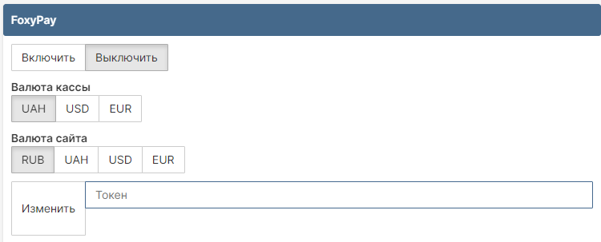

# GAMECMS 

# ВАЖНО
## Для работы кассы требуются рассширения для PHP (ОБЫЧНО ОНИ УСТАНОВЛЕНЫ ПО УМОЛЧАНИЮ)
- ### cURL
- ### SimpleXML
### Установить их можно через SHELL-клиент (если у вас VDS или VPS), если у вас хостинг, то посмотрите как включить рассширение для PHP через ISP или CPanel

- ### Если у вас VDS или VPS то используйте такие команды: 
```shell 
//Установка только с правами SUDO или ROOT, 
//Смотрим версию php
php -v 
//У нас версия php7.4, если у вас другая меняем на свою
apt install php7.4-xml
//Если apache
systemctl restart apache2
//NGINX
systemctl reload nginx
```
# Установка кассы

1. Загрузите и распакуйте архив:
   - Для лицензионной GameCMS: папка GameCMS

2. Загрузите содержимое архива на свой сайт в корневой каталог.


Модуль поддерживает без калькулятора курса 3 валюты: USD, UAH, EUR. 
ЕСЛИ У ВАС УКАЗАНА ВАЛЮТА САЙТА USD, UAH, EUR, ТО ВАЛЮТА САЙТА ДОЛЖНА БЫТЬ ТАКАЯ, КАК И ВАЛЮТА КАССЫ.
- Пример: Валюта сайта: USD, то и валюта кассы должна принимать только USD.
ЕСЛИ ЖЕ У ВАС УКАЗАНЫ KZT ИЛИ ДРУГИЕ ВАЛЮТЫ, КОТОРЫЕ ПОДДЕРЖИВАЮТ КАЛЬКУЛЯЦИЮ, ТО ВЫ МОЖЕТЕ УКАЗАТЬ ЛЮБУЮ ВАЛЮТУ КАССЫ.
- Пример: Валюта сайта: KZT, значит можно использовать валюты кассы, такие, как: USD, EUR, UAH

- Настройка валюты кассы (для выборки валюты кассы, вам нужно в самой FoxyPay кассе выбрать идентичную валюту):
<p align="center">
 
</p>


3. Откройте файл по пути `ajax/actions_m.php`.

4. Найдите `break;`.

5. После `break;` вставьте следующий код:
```php
case 'foxypay':
	if (empty($cashierSettings->foxypay_token)) {
		error_log('Error: Способ оплаты не настроен');
		throw new Exception('Способ оплаты не настроен');
	}

	if($cashierSettings->site_currency == "RUB"){
		if($cashierSettings->foxypay_currency == "UAH"){
			$amount = ($amount / (new CurrencyConverter)->getCurrencyRUB("UAH", 2)) * 1000;
		}if($cashierSettings->foxypay_currency == "USD"){
			$amount = $amount / (new CurrencyConverter)->getCurrencyRUB("USD", 0);
			$amount = number_format($amount, 2, '.', '');
			$amount = $amount * 100;
		}if($cashierSettings->foxypay_currency == "EUR"){
			$amount = $amount / (new CurrencyConverter)->getCurrencyRUB("EUR", 3);
			$amount = number_format($amount, 3, '.', '');
			$amount = $amount * 100;
		}
	}else{
		$amount = $amount * 100;
	}

	$curl = new Curl();
	$curl->setHeader('token', $cashierSettings->foxypay_token);

	$curl->post('https://foxypay.net/api/payment', [
		'amount' => $amount,
		'description' => $orderDesc,
		'webhook_url' => $full_site_host . 'purse?foxypay=pay',
		'success_url' => $full_site_host . 'purse?result=success',
		'fail_url' => $full_site_host . 'purse?result=fail',
		'info' => user()->id,
	]);

	$response = json_decode($curl->response, true);

	if (empty($response['redirect_url'])) {
		error_log('Error: Нет ссылки');
		throw new Exception("Нет ссылки");
	}

	Payments::showLink($response['redirect_url']);
break;

```


6. Правка файла `modules/purse/index.php`:

   6.1 - Вставьте перед `$fail = '';`
```php
include_once (__DIR__.'/modules_foxypay.php');
```


7. Импортируйте в базу `base.sql` (это добавит нужные колонки).

8. Редактируeм `inc/merchants.php`:
   - Найдите массив, например: или любой другой
	
 ```php
'ps'      		=> [
		'title' => 'Paysera',
		'name'  => 'Paysera',
		'image' => 'paysera.jpg'
],
```
> После вставляем код
```php
'foxypay'      		=> [
		'title' => 'Моментальное зачисление средств на баланс.',
		'name'  => 'FoxyPay',
		'image' => 'foxypay.png'
],
```


9. Админ-центр

- Открываем `ajax\actions_panel.php`
- Вставляем код в самый низ
```php
if(isset($_POST['editFoxyPaySystem'])) {
	$foxypay_token = check(trim($_POST['foxypay_token']), null);

	if(empty($foxypay_token)) {
		exit('<p class="text-danger">Вы заполнили не все поля!</p>');
	}

	$STH = $pdo->prepare("UPDATE config__bank SET foxypay_token=:foxypay_token LIMIT 1");
	write_log("Отредактирован FoxyPay");

	$STH->execute([':foxypay_token' => $foxypay_token]);
	exit('<p class="text-success">Настройки изменены!</p>');
}

```
- Дальше находим строку с начиная с if (isset($_POST['change_value'])) и меняем код на этот:
```php
if (isset($_POST['change_value'])) {
	$table = check($_POST['table'], null);
	$attr = check($_POST['attr'], null);
	$value = check($_POST['value'], null);
	$id = check($_POST['id'], "int");

	if (empty($attr)) {
		exit();
	}
	if (check_for_php($_POST['value'])) {
		exit();
	}
	if (ifSafeMode()) {
		if (($_POST['value'] != check($_POST['value'], "int")) && (!in_array($_POST['value'], ['RUB', 'USD', 'EUR', 'UAH']))) {
			exit();
		}
		if (
			!in_array(
				check($_POST['table'], null),
				['config', 'users', 'config__bank', 'config__secondary', 'config__email', 'config__prices']
			)
		) {
			exit();
		}
	}

	if (empty($value) && $value != 0) {
		$value = '';
	}

	if (empty($id)) {
		$STH = pdo()->prepare("UPDATE $table SET `$attr`=:value");
		$STH->execute([':value' => $value]);
	} else {
		$STH = pdo()->prepare("UPDATE $table SET `$attr`=:value WHERE `id`='$id' LIMIT 1");
		$STH->execute([':value' => $value]);
	}
	exit();
}
```
#11 js
- Открываем `ajax/ajax-admin.js`и в самый низ вставляем 


```javascript
function editFoxyPaySystem() {
	let data = {};
	data['editFoxyPaySystem'] = '1';
	data['foxypay_token'] = $('#foxypay_token').val();
	$.ajax({
		type: "POST",
		url: "../ajax/actions_panel.php",
		data: create_material(data),
		success: function (html) {
			$("#edit_foxypay_result").html(html);
		}
	});
}
```

## Шаблон для админ панели
- Открывем `templates/admin/tpl/payments.tpl`
- Листаем в самый низ видим 2 </div>
```html
	</div>
</div>
```
- Между ними ставим следующий код
```html
<div class="block">
	<div class="block_head">
		FoxyPay
	</div>
	<div class="form-group mb-10">
		<div class="btn-group" data-toggle="buttons" id="foxypayTrigger">
			<label class="btn btn-default {if($merchants->foxypay == 1)} active {/if}"
					onclick="change_value('config__bank','foxypay','1','1');">
				<input type="radio">
				Включить
			</label>
			<label class="btn btn-default {if($merchants->foxypay == 2)} active {/if}"
					onclick="change_value('config__bank','foxypay','2','1');">
				<input type="radio">
				Выключить
			</label>
		</div>
	</div>
	<div class="form-group mb-10">
        <b> Валюта кассы на FoxyPay</b>
        <div class="form-group">
            <div class="btn-group" data-toggle="buttons">
                <label class="btn btn-default {if($merchants->foxypay_currency == 'UAH')} active {/if}"
                       onclick="change_value('config__bank','foxypay_currency','UAH','1');">
                    <input type="radio">
                    UAH
                </label>
    
                <label class="btn btn-default {if($merchants->foxypay_currency == 'USD')} active {/if}"
                       onclick="change_value('config__bank','foxypay_currency','USD','1');">
                    <input type="radio">
                    USD
                </label>
    
                <label class="btn btn-default {if($merchants->foxypay_currency == 'EUR')} active {/if}"
                       onclick="change_value('config__bank','foxypay_currency','EUR','1');">
                    <input type="radio">
                    EUR
                </label>
            </div>
        </div>
    </div>	
	<div class="form-group mb-10">
        <b> Валюта сайта </b>
        <div class="form-group">
            <div class="btn-group" data-toggle="buttons">
                <label class="btn btn-default {if($merchants->site_currency == 'RUB')} active {/if}"
                       onclick="change_value('config__bank','site_currency','RUB','1');">
                    <input type="radio">
                    RUB
                </label>                
				<label class="btn btn-default {if($merchants->site_currency == 'UAH')} active {/if}"
                       onclick="change_value('config__bank','site_currency','UAH','1');">
                    <input type="radio">
                    UAH
                </label>
    
                <label class="btn btn-default {if($merchants->site_currency == 'USD')} active {/if}"
                       onclick="change_value('config__bank','site_currency','USD','1');">
                    <input type="radio">
                    USD
                </label>
    
                <label class="btn btn-default {if($merchants->site_currency == 'EUR')} active {/if}"
                       onclick="change_value('config__bank','site_currency','EUR','1');">
                    <input type="radio">
                    EUR
                </label>
            </div>
        </div>
    </div> 	
	<div class="input-group">
		<span class="input-group-btn">
			<button class="btn btn-default pd-23-12" type="button"
					onclick="editFoxyPaySystem();">
				Изменить
			</button>
		</span>
		<input type="text"
				class="form-control"
				id="foxypay_token"
				maxlength="255"
				autocomplete="off"
				value="{{$merchants->foxypay_token}}"
				placeholder="Токен">
	</div>
	<div id="edit_foxypay_result"></div>
	<div class="bs-callout bs-callout-info mt-10">
		<h5>
			<a target="_blank" href="https://github.com/twileck/gameCMSmodule/tree/master/gamecms">
				<span class="glyphicon glyphicon-link"></span> Нажмите для перехода к инструкции
			</a>
		</h5>
		<table>
			<tr>
				<td style="text-align: right">URL оповещения:</td>
				<td>&nbsp&nbsp<b>{full_site_host}purse?foxypay=pay</b>
				</td>
			</tr>
			<tr>
				<td style="text-align: right">URL успешной оплаты:</td>
				<td>&nbsp&nbsp<b>{full_site_host}purse?result=success</b>
				</td>
			</tr>
			<tr>
				<td style="text-align: right">URL ошибки:</td>
				<td>&nbsp&nbsp<b>{full_site_host}purse?result=fail</b>
				</td>
			</tr>
		</table>
	</div>
</div>		
```


