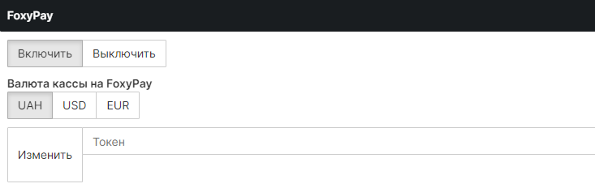

# UNI GAMECMS

# ВАЖЛИВО
## Для роботи каси потрібні розширення для PHP (ЗВИЧАЙНО ВОНИ ВСТАНОВЛЕНІ ЗА УМОВЧЕННЯМ)
- ### cURL
- ### SimpleXML
### Встановити їх можна через SHELL-клієнт (якщо у вас VDS або VPS), якщо у вас хостинг, то подивіться як увімкнути розширення для PHP через ISP або CPanel

- ### Якщо у вас VDS або VPS, тоді використовуйте такі команди:
```shell
//Установка тільки з правами SUDO або ROOT,
//Дивимося версію php
php -v
//У нас версія php7.4, якщо у вас інша змінюємо свою
apt install php7.4-xml
//Якщо apache
systemctl restart apache2
//NGINX
systemctl reload nginx
```
# Встановлення каси
1. Завантажте та розпакуйте архів:
 - Для UnigameCMS: папка UnigameCMS

2. Завантажте вміст архіву на свій сайт у кореневий каталог.

- Потрібно вказати валюту вашого сайту, приклад:
- Налаштування валют `https://site/admin/bank`
<p align="center">
 
</p>
- Налаштування валюти каси (для вибірки валюти каси, вам потрібно в налаштуваннях магазину FoxyPay вибрати ідентичну валюту):
<p align="center">
 
</p>
ЯКЩО У ВАС ВКАЗАНА ВАЛЮТА САЙТУ USD, UAH, EUR, ТО ВАЛЮТА САЙТУ МАЄ БУТИ ТАКА, ЯК І ВАЛЮТА КАСИ.

- Приклад: Валюта сайту: USD, то й валюта каси має приймати лише USD.

ЯКЩО Ж У ВАС ВКАЗАНІ KZT АБО ІНШІ ВАЛЮТИ, ЯКІ ПІДТРИМЮЮТЬ КАЛЬКУЛЯЦІЮ, ТО ВИ МОЖЕТЕ ВКАЗАТИ БУДЬ-ЯКУ ВАЛЮТУ КАСИ.

- Приклад: Валюта сайту: KZT, тоді можна використовувати валюти кас такі як: USD, EUR, UAH

3. Відкрийте файл на шляху `ajax/actions_m.php`.

4. Знайдіть `break;`.

5. Після `break;` вставте наступний код:
```php
case 'foxypay':
    if (empty($cashierSettings->foxypay_token)) {
        error_log('Error: Спосіб оплати не налаштований');
        throw new Exception('Спосіб оплати не налаштований');
    }

    $curl = new Curl();
    $curl->setHeader('token', $cashierSettings->foxypay_token);

    $curl->post('https://foxypay.net/api/payment', [
        'amount' => $amount,
        'description' => $orderDesc,
        'webhook_url' => $full_site_host . 'purse?foxypay=pay',
        'success_url' => $full_site_host . 'purse?result=success',
        'fail_url' => $full_site_host . 'purse?result=fail',
        'info' => $user->id,
    ]);

    $response = json_decode($curl->response, true);

    if (empty($response['redirect_url'])) {
        error_log('Error: Немає посилання');
        throw new Exception("Немає посилання");
    }

    Payments::showLink($response['redirect_url']);
    break;
```

6. Виправлення файлу `modules/purse/index.php`:

 6.1 - Вставте перед `$fail = '';
```php
include_once (__DIR__.'/modules_foxypay.php');
```


 6.2 - Після `->set("{fp}", $bankConf->fowpay)`
 - Вставляємо
 - `->set("{foxypay}", $bankConf->foxypay)`

7. Імпортуйте до бази `base.sql` (це додасть потрібні колонки).

8. Редагуємо `inc\classes\class.payments.php`:
 - Знайдіть масив, наприклад:
	
 ```php
[
	'slug' => 'fowpay',
	'name' => 'FowPay'
]
```
> Увага! повинно вийти так
```php
[
	'slug' => 'fowpay',
	'name' => 'FowPay'
],
[
	'slug' => 'foxypay',
	'name' => 'foxypay'
]
```


9. Адмін-центр


- Відкриваємо `modules\admin\payments.php`
-Знаходимо
```php
$tpl->set("{qwact2}", $qwact[1]);
```

- Додаємо
```php
$tpl->set("{site_currency}", $bank_conf->site_currency);
$tpl->set("{foxypay_currency}", $bank_conf->foxypay_currency);
$tpl->set("{foxypay_token}", $bank_conf->foxypay_token);
$tpl->set("{foxypay_pay}", $bank_conf->foxypay);
```


10. - actions_panel
- Відкриваємо `ajax\actions_panel.php`
- Вставляємо код у самий низ
```php
if(isset($_POST['editFoxyPaySystem'])) {
	$foxypay_token = check(trim($_POST['foxypay_token']), null);

	if(empty($foxypay_token)) {
		exit('<p class="text-danger">Ви заповнили не усі поля!</p>');
	}

	$STH = $pdo->prepare("UPDATE config__bank SET foxypay_token=:foxypay_token LIMIT 1");
	write_log("Отредактирован FoxyPay");

	$STH->execute([':foxypay_token' => $foxypay_token]);
	exit('<p class="text-success">Налаштування змінено!</p>');
}
```
- Далі знаходимо рядок з if (isset($_POST['change_value'])) і змінюємо код на цей:
```php
if (isset($_POST['change_value'])) {
    $table = check($_POST['table'], null);
    $attr = check($_POST['attr'], null);
    $value = check($_POST['value'], null);
    $id = check($_POST['id'], "int");

    if (empty($attr)) {
        exit();
    }
    if (check_for_php($_POST['value'])) {
        exit();
    }
    if ($safe_mode == 1) {
        if ($_POST['value'] != check($_POST['value'], "int")) {
            exit();
        }
        if (
            !in_array(
                check($_POST['table'], null),
                ['config', 'users', 'config__bank', 'config__secondary', 'config__email', 'config__prices']
            )
        ) {
            exit();
        }
    }

    if (empty($value) && $value != 0) {
        $value = '';
    }

    if (empty($id)) {
        $STH = $pdo->prepare("UPDATE `$table` SET `$attr`=:value");
        $STH->execute([':value' => $value]);
    } else {
        $STH = $pdo->prepare("UPDATE `$table` SET `$attr`=:value WHERE `id`='$id' LIMIT 1");
        $STH->execute([':value' => $value]);
    }
    exit();
}
```

#11 js
- Відкриваємо `ajax\performers\acp.min.js` і в самий низ вставляємо


```javascript
function editFoxyPaySystem() {
    var data = {};
    data["editFoxyPaySystem"] = "1";
    data["foxypay_token"] = $("#foxypay_token").val();
    $.ajax({
        type: "POST",
        url: "../ajax/actions_panel.php",
        data: create_material(data),
        success: function (html) {
            $("#edit_foxypay_result").html(html);
        },
    });
}
```

## Шаблон
- Відкриємо `templates/standart/tpl/home/purse.tpl`

- знаходимо `{/if}` і після нього вставляємо код
```html
{if('{foxypay}' == '1')}
    <div class="custom-block">
        <div class="block">
            <div class="block_head">
                FoxyPay - оплата картками України та криптовалютою.
            </div>
            <div class="image-container">
                <label for="number_foxypay">
                    
                </label>
            </div>
            <input class="form-control" id="number_foxypay" placeholder="Введіть суму" value="{price}">
            <div id="balance_result_foxypay" class="mt-3"></div>
            <button class="btn btn-outline-primary btn-xl" onclick="refill_balance('foxypay');">Поповнити баланс</button>
        </div>
    </div>
{/if}

<style>
    .image-container {
        display: flex;
        justify-content: center;
    }

    .image-container label {
        display: flex;
        justify-content: center;
        width: 100%;
    }

    .image-container img {
        max-width: 100%;
        height: auto;
    }
</style>
```

## Шаблон для адмін панелі
- Відкриємо `templates/admin/tpl/payments.tpl`
- Гортаємо в самий низ і бачимо 2 </div>
```html
	</div>
</div>
```
- Між ними ставимо наступний код
```html
<div class="block">
    <div class="block_head">
        FoxyPay
    </div>
    <div class="form-group mb-10">
        <div class="btn-group" data-toggle="buttons" id="foxypayTrigger">
            <label class="btn btn-default {if('{foxypay_pay}' == 1)} active {/if}"
                onclick="change_value('config__bank','foxypay','1','1');">
                <input type="radio">
                Включить
            </label>
            <label class="btn btn-default {if('{foxypay_pay}' == 2)} active {/if}"
                onclick="change_value('config__bank','foxypay','2','1');">
                <input type="radio">
                Выключить
            </label>
        </div>
    </div>
    <div class="form-group mb-10">
        <b> Валюта кассы на FoxyPay</b>
        <div class="form-group">
            <div class="btn-group" data-toggle="buttons">
                <label class="btn btn-default {if('{foxypay_currency}' == 'UAH')} active {/if}"
                       onclick="change_value('config__bank','foxypay_currency','UAH','1');">
                    <input type="radio">
                    UAH
                </label>
    
                <label class="btn btn-default {if('{foxypay_currency}' == 'USD')} active {/if}"
                       onclick="change_value('config__bank','foxypay_currency','USD','1');">
                    <input type="radio">
                    USD
                </label>
    
                <label class="btn btn-default {if('{foxypay_currency}' == 'EUR')} active {/if}"
                       onclick="change_value('config__bank','foxypay_currency','EUR','1');">
                    <input type="radio">
                    EUR
                </label>
            </div>
        </div>
    </div>       
    <div class="input-group">
        <span class="input-group-btn">
            <button class="btn btn-default pd-23-12" type="button" onclick="editFoxyPaySystem();">
                Изменить
            </button>
        </span>
        <input type="text" class="form-control" id="foxypay_token" maxlength="255" autocomplete="off"
            value="{foxypay_token}" placeholder="Токен">
    </div>
    <div id="edit_foxypay_result"></div>
    <div class="bs-callout bs-callout-info mt-10">
        <h5>
            <a target="_blank" href="https://github.com/twileck/gameCMSmodule/tree/master/unigamecms">
                <span class="glyphicon glyphicon-link"></span> Натисніть , щоб перейти до інструкції
            </a>
        </h5>
        <table>
            <tr>
                <td style="text-align: right">URL оповіщення:</td>
                <td>&nbsp&nbsp<b>{full_site_host}purse?foxypay=pay</b>
                </td>
            </tr>
            <tr>
                <td style="text-align: right">URL успішної оплати:</td>
                <td>&nbsp&nbsp<b>{full_site_host}purse?result=success</b>
                </td>
            </tr>
            <tr>
                <td style="text-align: right">URL помилки:</td>
                <td>&nbsp&nbsp<b>{full_site_host}purse?result=fail</b>
                </td>
            </tr>
        </table>
    </div>
</div>
```


